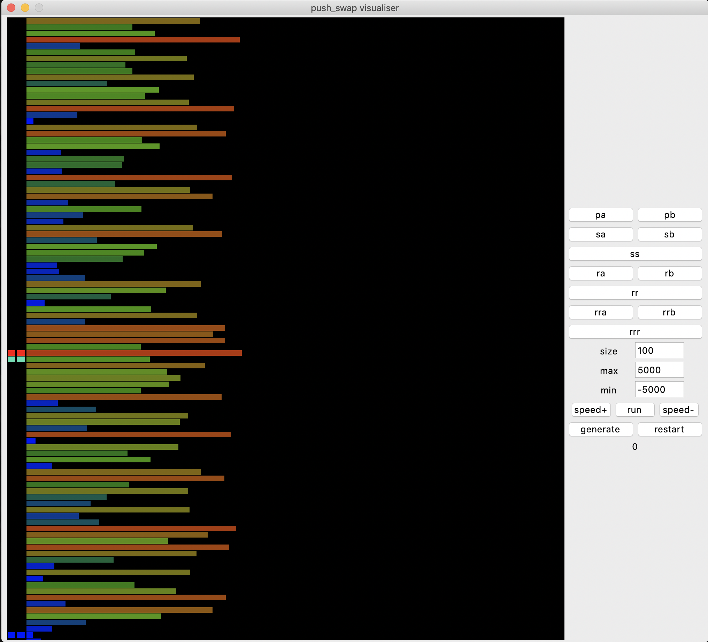

# push_swap_simulator
## Simulator and visualizer for push_swap

Push Swap is a program that takes as argument a space separated list of numbers and outputs a list of commands that can be used to sort them.
And this program is simulator of all the insurrections , and visualizer for your push_swap program

## Usage

usage : `./simulator.py [push_swap path]`

or if you want use only the sumilator: `./simulator.py -n`

